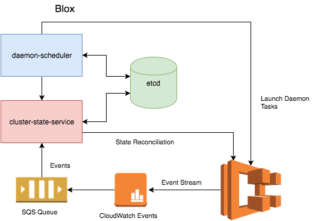

# 

### Description
Blox is a collection of open source projects for container management and orchestration. Blox gives you more control over how your containerized applications run on Amazon ECS. It enables you to build schedulers and integrate third-party schedulers on top of ECS, while leveraging Amazon ECS to fully manage and scale your clusters.

The *blox* project provides a scheduling framework to help you easily build custom tooling, such as schedulers, on top of Amazon ECS. The framework makes it easy to consume events from Amazon ECS, store the cluster state locally, and query the local data store though APIs. The *blox* project currently consists of two components:

* *cluster-state-service*
* *daemon-scheduler*
* *etcd*

The *cluster-state-service* consumes events from a stream of all changes to containers and instances across your Amazon ECS clusters, persists the events in a local data store, and provides APIs (e.g., search, filter, list, etc.) that enable you to query the state of your cluster so you can respond to changes in real-time. The *cluster-state-service* tracks your Amazon ECS cluster state locally, and manages any drift in state by periodically reconciling state with Amazon ECS.

The *daemon-scheduler* is a scheduler that allows you to run exactly one task per host across all nodes in a cluster. The scheduler monitors the cluster state and launches tasks as new nodes join the cluster, and it is ideal for running monitoring agents, log collectors, etc. The scheduler can be used as a reference for how to use the *cluster-state-service* to build custom scheduling logic, and we plan to add additional scheduling capabilities for different use cases.

The [*etcd*](https://github.com/coreos/etcd) is a distributed, consistent key-value store for shared configuration and service discovery.

### Deploying Blox

We provide two methods for deploying *blox*:
* Local deployment
* AWS deployment

#### Local Deployment

You can deploy locally and quickly try out Blox using our Docker Compose file. This allows you to get started with building custom schedulers using the cluster-state-service. The Docker Compose file launches the *blox* components, *cluster-state-service* and *daemon-scheduler*, along with a backing state store, etcd. Please see [Blox Deployment Guide](deploy) to launch *blox* using the Docker Compose file.

#### AWS Deployment

We also provide an AWS CloudFormation template to launch the *blox* stack easily on AWS. The AWS deployed *blox* stack makes use of AWS services designed to provide a secure public facing scheduler endpoint.

##### Creating a Blox stack on AWS

Deploying Blox using the AWS CloudFormation template in AWS sets up a stack consisting of the following components:
* An Amazon SQS queue is created for you, and Amazon CloudWatch is configured to deliver ECS events to your queue.
* *blox* components are set up as a service running on an Amazon ECS cluster. The *cluster-state-service*, *daemon-scheduler* , and etcd containers run as a single task on a container instance. The scheduler endpoint is made reachable, which allows you to securely interact with the endpoint.
* An Application Load Balancer (ALB) is created in front of your scheduler endpoint.
* An Amazon API Gateway endpoint is set up as the public facing frontend and provides an authentication mechanism for the *blox* stack. The API Gateway endpoint can be used to reach the scheduler and manage tasks on the ECS cluster.
* An AWS Lambda function acts as a simple proxy which enables the public facing API Gateway endpoint to forward requests onto the ALB listener in the VPC.

For more information about deployment instructions, see [Blox Deployment Guide](deploy).

### Building Blox

For more information about how to build these components, see [cluster-state-service](cluster-state-service) and [daemon-scheduler](daemon-scheduler).

### Contributing to Blox

All projects under Blox are released under Apache 2.0 and the usual Apache Contributor Agreements apply for individual contributors. All projects are maintained in public on GitHub, issues and pull requests use GitHub, and discussions use our [Gitter channel](https://gitter.im/blox). We look forward to collaborating with the community.

Components
ETCD
https://github.com/coreos/etcd

# Step 1: Launch Blox Components

## Step 1A: Create SQS Queue and Configure CloudWatch Events to send ECS events to the SQS Queue

Blox depends on an ECS event stream that is delivered via CloudWatch events. In order to use Blox,
you need to create an SQS queue and configure CloudWatch to deliver the ECS events to this SQS queue.
Blox provides a pre-built AWS CloudFormation template that will deploy and configure the required Amazon AWS components.
Once you have pulled the CloudFormation template from the Blox repository, run the following command using the AWS CLI:

aws cloudformation create-stack --stack-name BloxLocal-AWSComponents --template-body file://cloudformation_template.json --profile xpeppers-test

## Step 1B: Launch Blox

Next, download the Docker Compose file from the Blox repo.
Before launching Blox, you will first need to update docker-compose.yml with the following changes:
- Update the AWS_REGION value with the region of your ECS and SQS resources.
- Update the AWS_PROFILE value with your profile name

Questo Docker compose ha tre servizi
- scheduler
- css
- etcd

After you have updated docker-compose.yml, you can use the following commands to launch the Blox containers on your local Docker environment.
docker-compose up –d

# Step 2: Launch ECS Cluster
