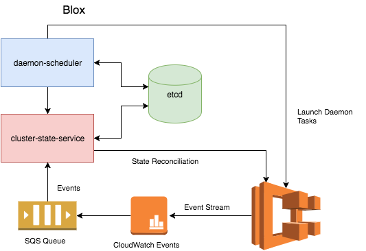

#  *workshop version*

### Description
Blox is a collection of open source projects for container management and orchestration. Blox gives you more control over how your containerized applications run on Amazon ECS. It enables you to build schedulers and integrate third-party schedulers on top of ECS, while leveraging Amazon ECS to fully manage and scale your clusters.

The *blox* project provides a scheduling framework to help you easily build custom tooling, such as schedulers, on top of Amazon ECS. The framework makes it easy to consume events from Amazon ECS, store the cluster state locally, and query the local data store though APIs. The *blox* project currently consists of the following components:

* *cluster-state-service*
* *daemon-scheduler*
* *etcd*

The **cluster-state-service** consumes events from a stream of all changes to containers and instances across your Amazon ECS clusters, persists the events in a local data store, and provides APIs (e.g., search, filter, list, etc.) that enable you to query the state of your cluster so you can respond to changes in real-time. The *cluster-state-service* tracks your Amazon ECS cluster state locally, and manages any drift in state by periodically reconciling state with Amazon ECS.

The **daemon-scheduler** is a scheduler that allows you to run exactly one task per host across all nodes in a cluster. The scheduler monitors the cluster state and launches tasks as new nodes join the cluster, and it is ideal for running monitoring agents, log collectors, etc. The scheduler can be used as a reference for how to use the *cluster-state-service* to build custom scheduling logic, and we plan to add additional scheduling capabilities for different use cases.

The [**etcd**](https://github.com/coreos/etcd) is a distributed key value store that provides a reliable way to store data across a cluster of machines. It’s open-source and available on GitHub. etcd gracefully handles leader elections during network partitions and will tolerate machine failure, including the leader.

### Deploying Blox

We provide two methods for deploying *blox* components:
* Local deployment
* AWS deployment

#### Local Deployment

You can deploy locally and quickly try out Blox using our Docker Compose file. This allows you to get started with building custom schedulers using the cluster-state-service. The Docker Compose file launches the *blox* components, *cluster-state-service* and *daemon-scheduler*, along with a backing state store, etcd. Please see [Blox Deployment Guide](deploy/README.md) to launch *blox* using the Docker Compose file.

#### AWS Deployment

In this workshop we use only the local deployment. For AWS Deployment and complete deployment guide go to official [Blox](https://github.com/blox/blox) repository
