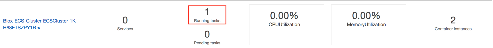

# Blox Local Installation

## Introduction

Blox is an open source cluster manager and orchestration framework that enables developers to easily build, test, and run containerized applications on Amazon ECS using a common toolset. This document describes how to install the Blox framework locally and on top of AWS.


### Framework Components (Docker images)

- daemon-scheduler
- cluster-state-service
- Etcd

### Required AWS Components (AWS Infrastructure)

- Amazon CloudWatch
- Amazon ECS
- Amazon IAM
- Amazon SQS

### Prerequisites

#### AWS CLI

You will need to have the AWS CLI installed locally to create the required AWS components. Follow the instructions at [Installing the AWS Command Line Interface](http://docs.aws.amazon.com/cli/latest/userguide/installing.html) to install the CLI before proceeding.

#### IAM Permissions

The AWS profile you use with the AWS CLI will need appropriate permissions to create the required AWS components. To make this easier, we have created IAM Policy Documents for both the Local and AWS installations. Follow the steps on the [Creating a New IAM Policy](http://docs.aws.amazon.com/IAM/latest/UserGuide/access_policies_create.html) guide to create this policy. In the `Create Policy` wizard, select `Create Your Own Policy` and paste the contents of the appropriate policy file in the `Policy Document` text area. Once you have created the IAM Policy, you will need to attach the policy to the AWS user that you will use to deploy Blox via the installation instructions below. If your AWS user already has full administrator permissions to your AWS account, you can ignore this step.

- [Local Installation IAM Policy Document](docker/conf/cloudformation_policy.json)

**Warning**: Attaching the `AWS Installation IAM Policy Document` to a user grants the user IAM administrator privileges, which the CloudFormation template uses to create new IAM roles and policies required by the Blox framework. You should only attach this policy to users that you would trust with full administrator access to your AWS account.


## Local Installation

Our recommended way for getting started with Blox is to deploy the framework on your local Docker installation. We provide a pre-built AWS CloudFormation template that will deploy the required AWS components, and a Docker Compose file to launch the Blox framework in your local Docker environment. Please ensure that you have installed [Docker](https://docs.docker.com/engine/installation/) and [Docker Compose](https://docs.docker.com/compose/install/) locally before proceeding.

### Blox Components

Run the following instructions to create the required AWS components needed to run the Blox framework locally.

#### Create AWS Components (SQS, CLoudWatch)

```
$ cd <GitRepoBase>/deploy/local/1_blox_components/aws
$ aws --region <region> cloudformation create-stack --stack-name Blox-AWS-Components --template-body file://./deploy/docker/conf/cloudformation_template.json --profile <profile>
```

#### Create Docker Components (cluster state service, daemon scheduler, etcd)

Before launching Blox, you will first need to update `<GitRepoBase>/deploy/local/1_blox_components/docker/conf/docker-compose.yml` with the following changes:

- Update the `AWS_REGION` value with the region of your ECS and SQS resources.
- Update the `AWS_PROFILE` value with your profile name in ~/.aws/credentials. You can skip this step if you are using the `default` profile.

After you have updated `<GitRepoBase>/deploy/docker/conf/docker-compose.yml`, you can use the following commands to launch the Blox containers on your local Docker environment.

```
$ cd <GitRepoBase>/deploy/docker/conf/
$ docker-compose up -d
$ docker-compose ps
```

You have now completed the local installation of Blox. You can begin consuming the scheduler API at http://localhost:2000/.

### ECS Cluster

An Amazon EC2 Container Service (Amazon ECS) cluster is a logical grouping of container instances that you can place tasks on. When you first use the Amazon ECS service, a default cluster is created for you, but you can create multiple clusters in an account to keep your resources separate.

#### Create cluster

```
$ cd <GitRepoBase>/deploy/local/2_ecs_cluster
aws cloudformation create-stack --stack-name Blox-ECS-Cluster --template-body file://./cluster_template.json --parameters fil
e://./parameters_template.json --profile <profile>
```

#### Scheduling tasks

The Amazon ECS schedulers leverage the same cluster state information provided by the Amazon ECS API to make appropriate placement decisions.
You can use a predefined scheduler (Service Scheduler or Task Scheduler) or create your own schedulers with Blox framework

The **Service Scheduler** is ideally suited for long running stateless services and applications. The service scheduler ensures that the specified number of tasks are constantly running and reschedules tasks when a task fails (for example, if the underlying container instance fails for some reason). The service scheduler optionally also makes sure that tasks are registered against an Elastic Load Balancing load balancer.

The **Tasks Scheduler**  is ideally suited for processes such as batch jobs that perform work and then stop. For example, you could have a process call RunTask when work comes into a queue. The task pulls work from the queue, performs the work, and then exits. Using RunTask, you can allow the default task placement strategy to distribute tasks randomly across your cluster, which minimizes the chances that a single instance gets a disproportionate number of tasks.

The **Custom (Blox) Scheduler** enables you to build schedulers and integrate third-party schedulers with Amazon ECS while leveraging Amazon ECS to fully manage and scale your clusters. For more information, see StartTask in the Amazon EC2 Container Service API Reference.

For example we can launch a task and distribute it randomly across your cluster with the run-task api

##### Run Task

Modify the image url on task definition json file with your image repository URL
`"image": "831650818513.dkr.ecr.eu-west-1.amazonaws.com/paolol/bloxdemo:latest"`

Register the task

```
$ cd <GitRepoBase>/deploy/local/3_ecs_task
aws ecs register-task-definition --cli-input-json file://./sample_task.json --region eu-west-1 --profile <profile>

```

Run the task
```
$ cd <GitRepoBase>/deploy/local/3_ecs_task
aws ecs run-task --cluster Blox-ECS-Cluster-ECSCluster-XXXX --task-definition BloxDemo:1 --region eu-west-1 --profile <profile>
```

